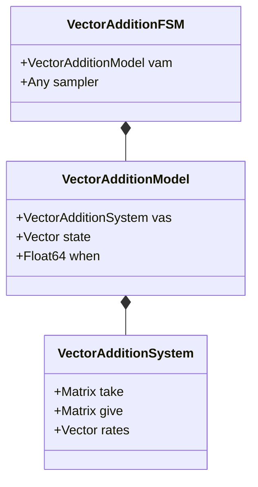

# Fleck

[](https://adolgert.github.io/Fleck.jl/stable)
[](https://adolgert.github.io/Fleck.jl/dev)
[](https://github.com/adolgert/Fleck.jl/actions)

This is a continuous-time simulation with the simplest-possible state and non-exponential transitions. The goal is to make a compact, fastest-possible non-exponential continuous-time simulation.

The simplest-possible state is a vector-addition system, which has a state that is a vector of integers just like chemical equations. A transition is defined by a vector of integers that represent how many values to take or give. However, for this simulation, the transition rates can be any function of the state and have exponential or non-exponential distributions.

## Vector Addition System

A [vector addition system](https://en.wikipedia.org/wiki/Vector_addition_system) (VAS) is a simple mathematical language to model systems. It is simpler than the Petri net language, but has the advantage of allowing for more free-form simulation design, as intensity functions can be arbitrary functions of state.



Simulation using the VAS requires concrete implementation of the interface:

```
zero_state(vas::VectorAdditionSystem)
vas_delta(vas::VectorAdditionSystem, transition_idx)
vas_initial(vas::VectorAdditionSystem, initial_state)
fire!(visitor, vas::VectorAdditionSystem, state, modify_state, rng)
simstep!(fsm::VectorAdditionFSM, state_update::Function, rng::AbstractRNG)
```

The method `fire!` first modifies state, then, for each clock in the system, it checks whether it has been newly enabled or disabled.

  - newly disabled: `visitor` is called to disable that transition
  - newly enabled: `visitor` is called to enable that transition and cache its newly calculated intensity
  - still enabled: we check if the new intensity differs from the old and if so use `visitor` to update the intensity

The method `simstep!` first applies `fire!`, followed by `next`.

## Sampling

Each sampler needs to implement the following interface:

```
next(sampler, when::Float64, rng::AbstractRNG)
set_clock!(sampler, clock::T, distribution::Exponential, enabled::Symbol, rng::AbstractRNG)
```

  - `next` is responsible for returning a tuple containing the next stopping time and which transition will cause it.
  - `set_clock!(sampler, clock::T, distribution, enabled::Symbol, rng::AbstractRNG)` is responsible for updating the transition `clock` 
