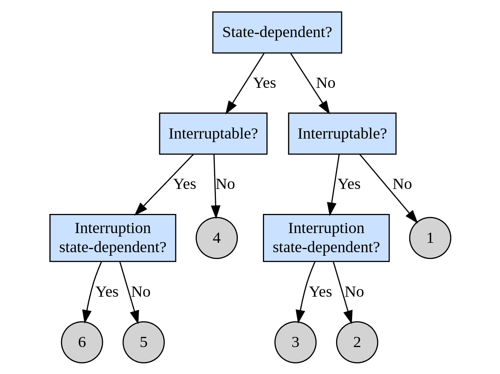

# Delay

There are a lot of ways to introduce non-exponential clocks into a simulation. What we should do here is talk about two main ones, the delay chemical master equation representation, older GSPN and DSPN methods, and classic semi-Markov processes. To be clear, when we say "delay" we mean any event which occurs after a non-exponentially distributed period of time.

The point of talking about delays is to provide examples of practical issues in modeling that our software and counting process formalism can help address.

Here's a diagram of some types of delays found in models of ecological and epidemiological systems:

Some examples of each type are below (we want to be able to implement each one):

  1. State-independent uninterruptible delay: a SIR model where the I to R transition occurs after some fixed duration $\tau$.
  2. State-independent delay with state-independent interruption: consider the SIR model of type 1, but where there is an additional transition from I to death, with constant per-capita hazard $\mu$. Then the I to R transition may be interrupted by death with probability $1-e^{-\mu\tau}$, which is known at initiation of the delay clock.
  3. State-independent delay with state-dependent interruption: from the example of [3], consider a predator ($X$) prey ($Y$) model (including the events birth of prey, predation, and death of predators). Now assume that when prey give birth the juvenile prey requires time $\tau$ before becoming an adult. Also assume that juveniles are subject to predation, so they have a per-capita hazard of $\beta X$. Because the rate of predation upon juveniles is a function of state $X$ which may change before completion of the maturation phase $\tau$ due to other events, probability of interruption is not known at initiation.
  4. State-dependent uninterruptible delay: Consider a model where larvae compete for resources, so that the duration of time $\tau(X)$ required for maturation is explicitly a function of the state $X$, but that the larval stage is invulnerable to death, and so cannot be interrupted. An example is the damselfly model of [4] without death.
  5. State-dependent delay with state-independent interruption: Consider the damselfly model of [4]; a larvae's maturation delay $\tau(X)$ depends on the density of other larvae as they compete for a resource, but maturing larvae also suffer constant per-capita mortality $\mu$.
  6. State-dependent delay with state-dependent interruption: Consider complicating the damselfly model by making larval mortality state dependent, perhaps by introducing a predator class or cannibalism among the larvae.

Perhaps it would be really nice to have a single model where we could walk from type 1 to type 6, but I can't think of an example that isn't extremely artifical (e.g. infectious persons eating each other).

## Delay chemical master equation

The chemical kinetics people have recently worked out recipes which teach people how to use what they call the DCME (delay chemical master equation) to represent systems with delays of the types commonly encountered in chemical models. Papers [1,2] both develop this work, though [2] is more clear and we will follow that in this brief review.

The DCME is given below:

$$
\begin{align*}

\frac{\partial}{\partial t}P(X,t) &= -\sum_{R_{j}\in M_{0d}} a_{j}(X)P(X,t) + \sum_{R_{j}\in M_{0d}} a_{j}(X-\nu_{j})P(X-\nu_{j},t) \\
&- \sum_{R_{j}\in M_{dn}} \sum_{X_{i}\in I(X)}a_{j}(X_{i})P(X,t;X_{i},t-\tau_{j}) + \sum_{R_{j}\in M_{dn}} \sum_{X_{i}\in I(X)} a_{j}(X_{i})P(X-\nu_{j},t;X_{i},t-\tau_{j}) \\
&- \sum_{R_{j}\in M_{dc}}\sum_{X_{i}\in I(X)} a_{j}(X_{i})P(X,t;X_{i},t-\tau_{j}) + \sum_{R_{j}\in M_{dc}}\sum_{X_{i}\in I(X)} a_{j}(X_{i}) P(X-\nu_{j}^{p},t;X_{i},t-\tau_{j}) \\
&- \sum_{R_{j}\in M_{dc}} a_{j}(X)P(X,t) + \sum_{R_{j}\in M_{dc}} a_{j}(X-\nu_{j}^{r}) P(X-\nu_{j}^{r},t)
\end{align*}
$$

The first two terms are for non-delayed reactions $M_{0d}$ and therefore are the same as the typical CME (chemical master equation). Namely they are the probability the system is in $X$ at $t$ and is pushed out by a reaction $R_{j}$, and the second is the probability the state is one reaction $R_{j}$ away from $X$ at time $t$.

The second two terms deal with delayed non-consuming reactions $M_{dn}$. The first of these two is the probability the system was in some state $X_{i}$ at time $t-\tau_{j}$ when $R_{j}$ initiated and is about to leave state $X$ at time $t$ when that reaction completes. The second of these two is the probability $R_{j}$ initiated at time $t-\tau_{j}$ and is currently in state $X-\nu_{j}$, and so will enter $X$ at time $t$.

The last four terms deal with delayed consuming reactions $M_{dc}$. The first two of these are equivalent to the previous second two terms, but with respect to state changes originaing from the second update point (upon competion of reaction), upon which the state change vector $\nu_{j}^{p}$ is applied.

The final two terms are the probability that the state is in $X$ at $t$ and is about to leave due to the initiation of a delayed consuming reaction (upon which the state change vector $\nu_{j}^{p}$ will be applied). the last is the probability that due to initiation, the state will jump into $X$ at time $t$.

## Bibliography

  1. [Lafuerza, Luis F., and Raul Toral. "Stochastic description of delayed systems." Philosophical Transactions of the Royal Society A: Mathematical, Physical and Engineering Sciences 371.1999 (2013): 20120458.](https://doi.org/10.1098/rsta.2012.0458)
  2. [Leier, Andre, and Tatiana T. Marquez-Lago. "Delay chemical master equation: direct and closed-form solutions." Proceedings of the Royal Society A: Mathematical, Physical and Engineering Sciences 471.2179 (2015): 20150049.](https://doi.org/10.1098/rspa.2015.0049)
  3. [Brett, Tobias, and Tobias Galla. "Generating functionals and Gaussian approximations for interruptible delay reactions." Physical Review E 92.4 (2015): 042105.](https://journals.aps.org/pre/abstract/10.1103/PhysRevE.92.042105)
  4. [Nisbet, R. M., and W. S. C. Gurney. "The systematic formulation of population models for insects with dynamically varying instar duration." Theoretical Population Biology 23.1 (1983): 114-135.](https://www.sciencedirect.com/science/article/pii/0040580983900084)

## Attic

Random things that may be useful to plunder for ideas:

  1. https://github.com/slwu89/stochastic_ng
  2. https://github.com/slwu89/mosymodel/tree/master/premonition
  3. https://github.com/dd-harp/delay
  4. https://github.com/dd-harp/euler-abm
  5. https://github.com/dd-harp/mini-mash
  6. https://www.overleaf.com/project/5e3d95a0f8136c00010af62f
  7. https://www.overleaf.com/project/5bb3e39b92734f6c26b6fbd4
  8. https://www.overleaf.com/project/5f249f60d9e45f0001f710cf
  9. https://www.overleaf.com/project/5de6ab381e175e0001c8c6bd