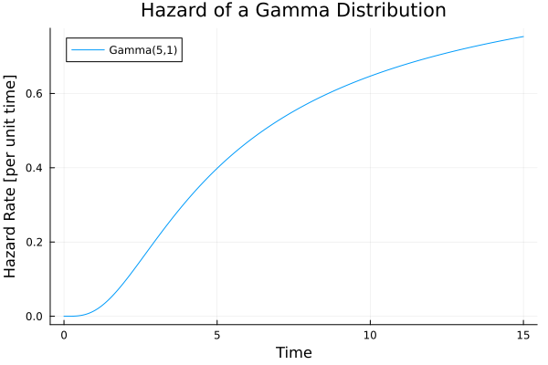
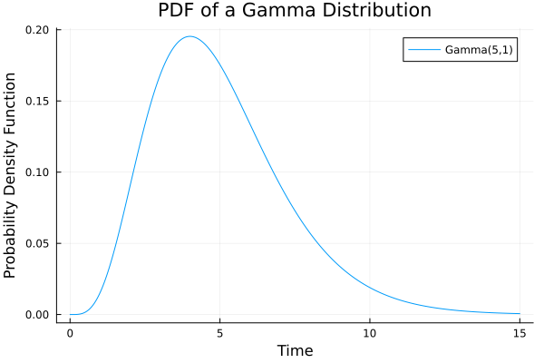
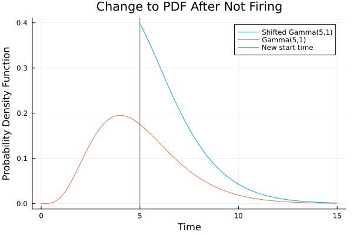

# How Fleck Decides What Happens Next

The flow of control in a [SimJulia](https://simjuliajl.readthedocs.io/en/stable/welcome.html) simulation is based on tasks. Each task rolls the dice and sets a wake-up time. In contrast, Fleck sees simulations as a set of events competing to be the first to happen. Let's look at how a probability distribution describes the time for an event to happen and then how they compete in Fleck.

## Distributions in Time

Let's say we have a detector watching for radiation particles to arrive from space. We have a sense that the rate of radiation to arrive is constant over time. This rate is the probability that an event happens given that it has not yet happened, called the *hazard rate*. In 

Hazard rate.

Probability distribution function.

Shifted probability distribution.

What's real is the hazard rate.

Competing processes understood as hazards.

Marginal for P[E1] vs P[E2].

for all exponentials.

for mostly exponentials and one non-exponential.
