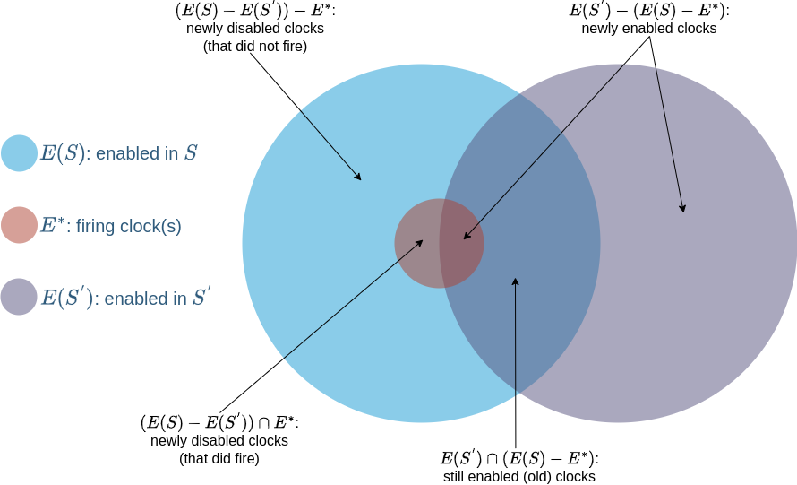

# Competing Clocks

A discrete event simulation tracks the effects of individual events in time. We classify discrete event simulations by the pace of advances in time. If time advances in steps of the same size, it is a *discrete-time* simulation. If time advances to the next event, whenever that event might happen, it is *continuous-time* simulation. This library supports continuous-time discrete-event simulations.

We write discrete event simulations by defining the state of a system and events that can act on that state. The state of a system can be the count of each chemical species for a chemical reaction system. It can be different numbers of chickens at different weights in different chicken coops for a farming simulation. It can be the age of each widget in an engine for a reliability simulation. These states are called the *physical state* of the system and vary widely in what they represent.

An *event* is an observable change of state at a time. It is a function where the argument is the current state of the system and the return value is the new state of the system. We say an event occurs, happens, or fires when we apply that function to the state. How that state changes is up to the model and how it defines the state, but what about *when* that state changes?

Given the current state of the system, there is a set of possible next events which could happen. We call the possible next events *enabled.* Think of the moment in time just after the simulation has begun or an event has just happened. At this moment, there may be multiple enabled events. Which one is next depends on how often that event happens. If our simulation includes both the radioactive decay of an unstable element and decay of iron, the unstable element will usually decay first. We describe the rates of these events using probability distributions in time. Each event has an associated continuous univariate distribution where the variable is time.

We can think of all event distributions in a model as a *bag of clocks.* The next one to ring is the next event to occur. When that event occurs, the state changes. When the state changes, it will enable some events and disable others. Enabled events are added to the bag of clocks. Disabled ones are removed. Fleck is responsible for managing this bag of clocks.

## Sets of Clocks

In Fleck, clocks can be either *enabled* or *disabled*. The firing of clocks triggers events, which change the state of the system. This in turn changes the set of clocks that are enabled. This is the basic algorithm to sample models that are phrased as continuous-time discrete-event systems.

It is worth examining what happens at a state update in more detail. Let ``E^{*}`` be the set of clocks (typically, just a single clock) that fires, and whose associated event updates state from ``S`` to ``S^{'}``. There are then three basic sets of clocks to consider: ``E(S)``, the set of clocks enabled in ``S``, ``E(S^{'})``, the set of clocks enabled in ``S^{'}``, and ``E^{*}``, the set of clocks that fired.

Newly enabled clocks are those that are enabled in ``S^{'}`` not part of the set that was enabled in ``S`` and remains enabled in ``S^{'}``. Newly disabled clocks are those that were enabled in ``S`` but are not enabled in ``S^{'}``. Finally old clocks are those that were enabled in ``S``, and remain so in ``S^{'}``.

All these sets are visualized in the figure below, reproduced from "Stochastic petri nets: Modelling, stability, simulation" by Peter J. Haas (2002).

Fleck is responsible for knowing ``E^{*}``, but it is the main event loop of the simulation using Fleck that decides which clocks to disable and enable.

## References

[Haas:2006]	PJ. Haas, “[Stochastic petri nets: Modelling, stability, simulation](https://link.springer.com/book/10.1007/b97265),” Springer Science & Business Media, 2006.