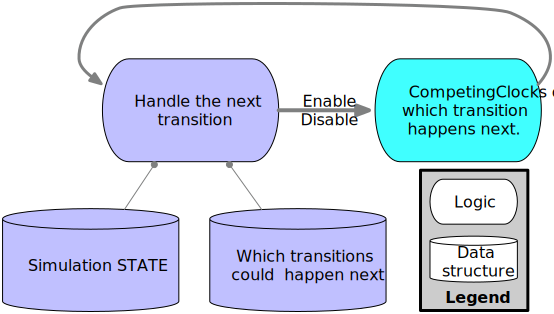

```@meta
CurrentModule = CompetingClocks
```

# CompetingClocks

Fast, composable samplers for stochastic discrete-event simulation.
This package gives your simulation or simulation framework statistical features like common random
numbers, likelihood tracking, and first-class support for non-Exponential distributions.

**This isn't a simulation framework.** It's a component you can use to sample event times for simulation
or to calculate the likelihood of a sample path for statistical estimation.

 * Simulations of chemical reactions.
 * Queueing theory models of networks, production, and computation.
 * Epidemiological models of disease spread among individuals.
 * Vector-addition systems.
 * Generalized stochastic Petri nets.
 * Generalized semi-Markov Processes.



The background work for this library comes from [Continuous-time, discrete-event simulation from counting processes](https://arxiv.org/abs/1610.03939), by Andrew Dolgert, 2016.


## Usage

The library provides you with samplers. Each sampler has the same interface. Here, a distribution is a [Distributions.ContinuousUnivariateDistribution](https://juliastats.org/Distributions.jl/stable/univariate/#Continuous-Distributions), `RNG` is a [random number generator](https://docs.julialang.org/en/v1/stdlib/Random/#Generators-(creation-and-seeding)), the `key` is some identifier (maybe an integer) for the event, and an enabling time is a zero-time for the given distribution.

 * [enable!](@ref)`(sampler, key, distribution, enabling_time))` - to start the clock on when an event will fire next.

 * [disable!](@ref)`(sampler, key)` - to turn off an event so it can't fire.

 * [next](@ref)`(sampler)` - to ask this library who could fire next.

 * [fire!](@ref)`(sampler, key, time)` - choose which event happens at what time.

Different samplers are specialized for sampling more quickly and accurately for different applications. For instance, some applications have very few events enabled at once, while some have many. Some applications use only exponentially-distributed events, while some have a mix of distribution types. Because continuous-time discrete event systems can fire many events, the literature has focused on reducing the number of CPU instructions required to sample each event, and this library reflects that focus.

## Why Use This?

If I make a quick simulation for myself, I sample distributions the moment an event is enabled and store the firing times in a [priority queue](https://juliacollections.github.io/DataStructures.jl/v0.12/priority-queue.html). When would I switch to this library?

 * I want to evaluate the effect of changing simulation parameters by comparing multiple runs with [common random numbers](https://en.wikipedia.org/wiki/Variance_reduction#Common_Random_Numbers_(CRN)).

 * I'm looking at rare events, so I want to use splitting techniques and [importance sampling](https://en.wikipedia.org/wiki/Importance_sampling).

 * Performance matters (which it often doesn't), so I would like to try different samplers on my problem.

 * I want to focus on developing and testing my *model* not my *simulation algorithm*; CompetingClocks is designed and tested with care to ensure correctness.
