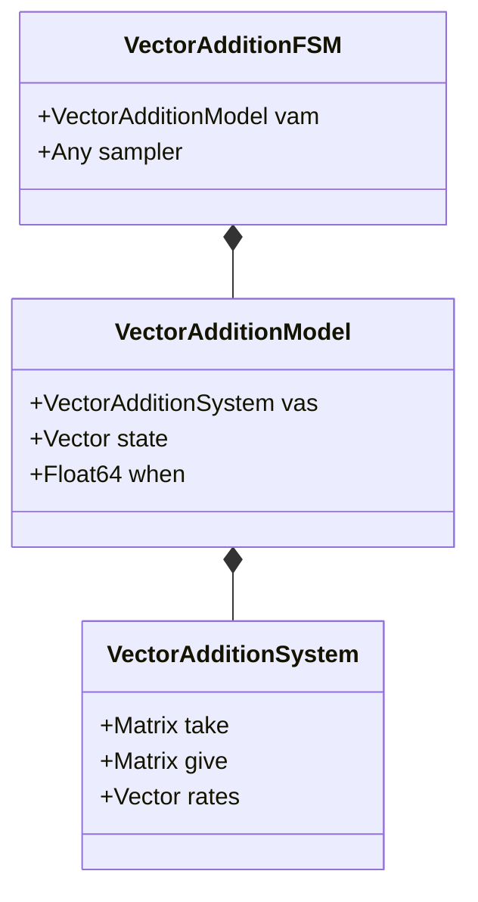

# Vector Addition System

A [vector addition system](https://en.wikipedia.org/wiki/Vector_addition_system) (VAS) is a simple mathematical language to model systems. It is simpler than the Petri net language, but has the advantage of allowing for more free-form simulation design, as intensity functions can be arbitrary functions of state.



Simulation using the VAS requires concrete implementation of the interface:

```
zero_state(vas::VectorAdditionSystem)
vas_delta(vas::VectorAdditionSystem, transition_idx)
vas_initial(vas::VectorAdditionSystem, initial_state)
fire!(visitor, vas::VectorAdditionSystem, state, modify_state, rng)
simstep!(fsm::VectorAdditionFSM, state_update::Function, rng::AbstractRNG)
```

The method `fire!` first modifies state, then, for each clock in the system, it checks whether it has been newly enabled or disabled.

  - newly disabled: `visitor` is called to disable that transition
  - newly enabled: `visitor` is called to enable that transition and cache its newly calculated intensity
  - still enabled: we check if the new intensity differs from the old and if so use `visitor` to update the intensity

The method `simstep!` first applies `fire!`, followed by `next`.
